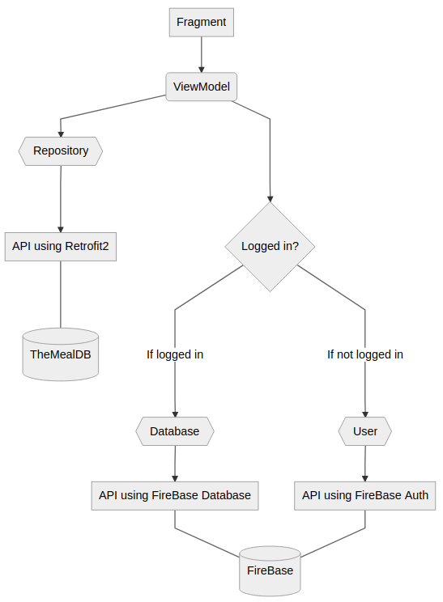
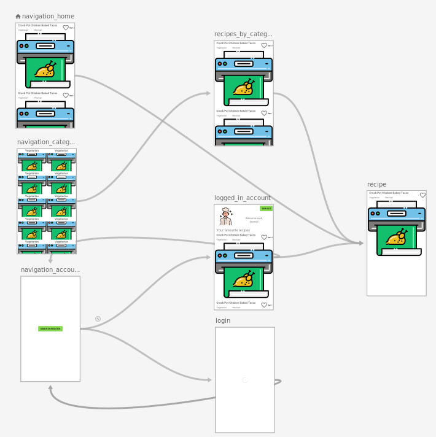
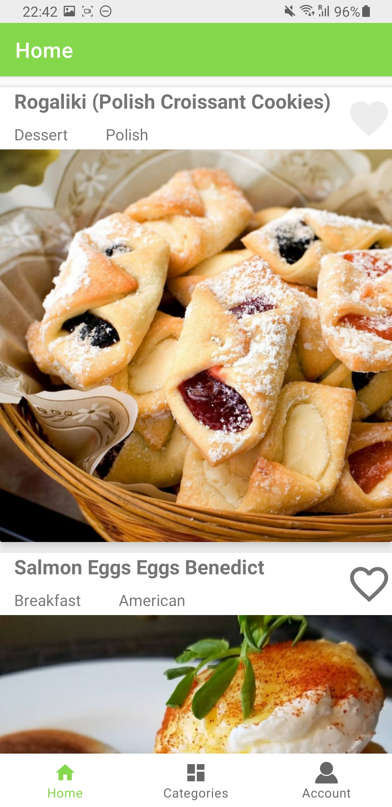
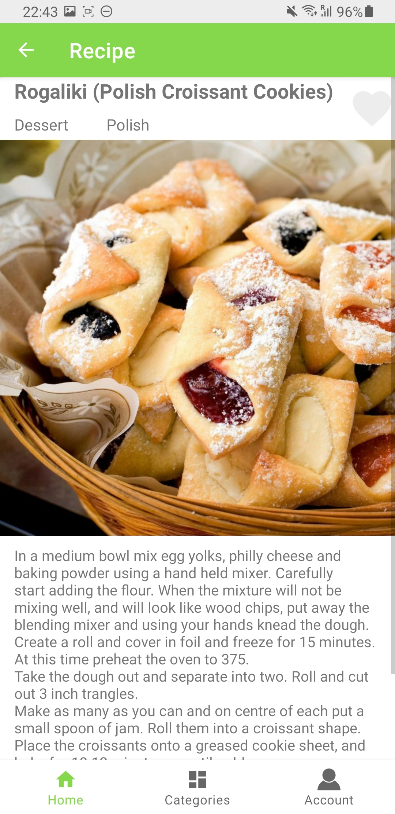
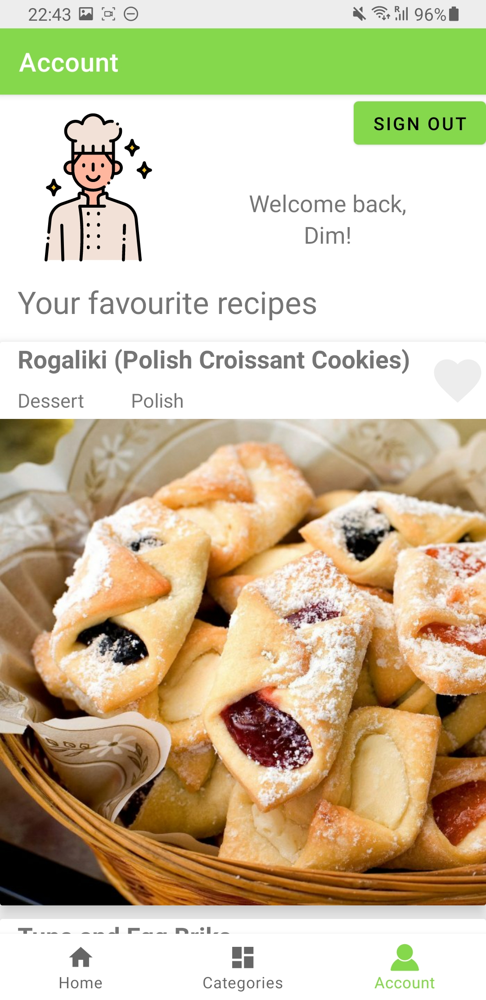
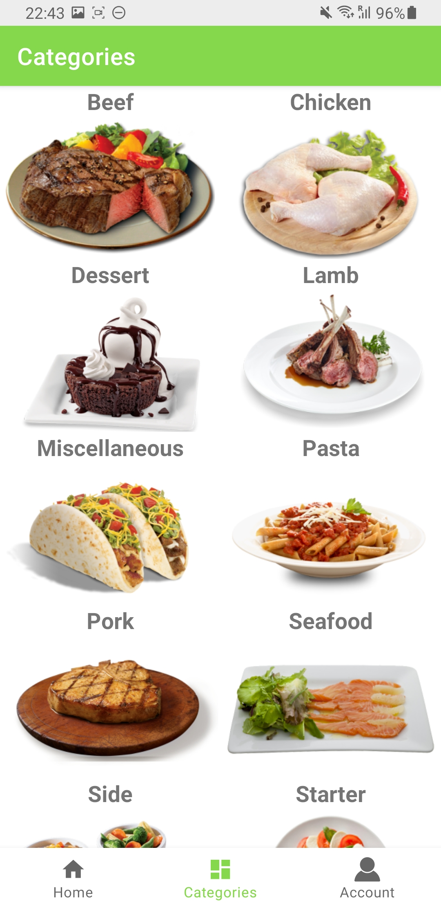
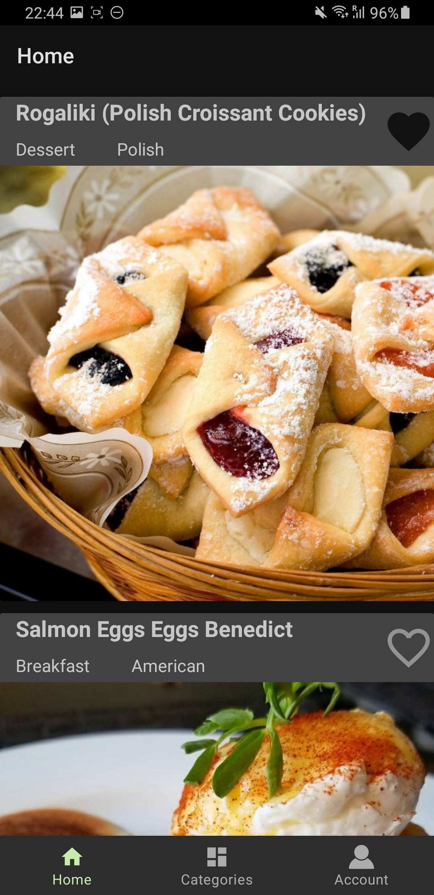
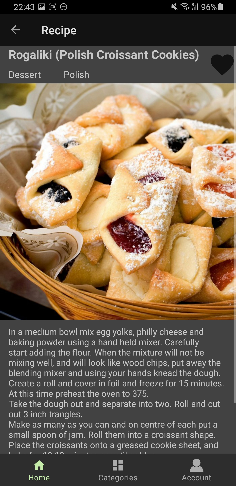
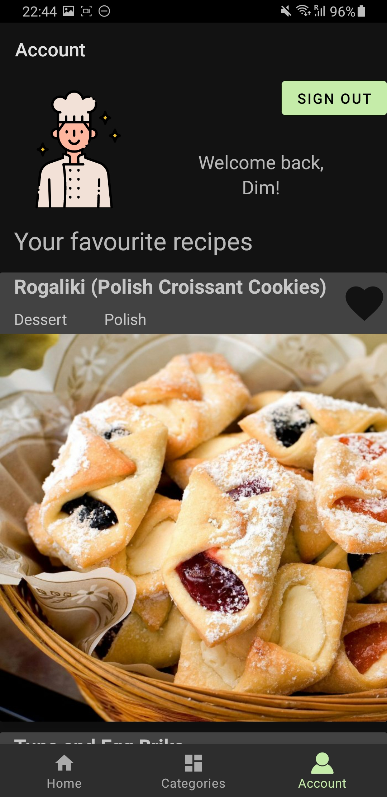
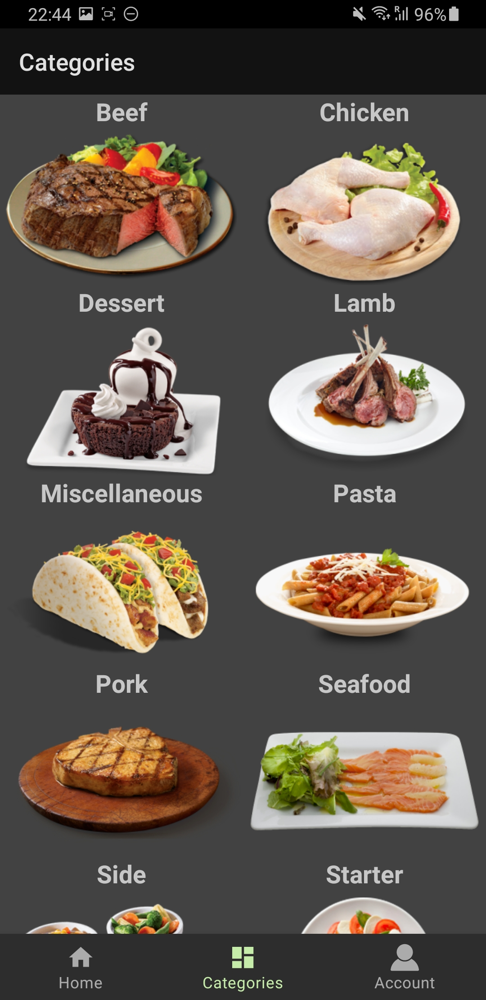

# Worldly Recipe Book

**Summary:** An Android application has been developed for the Mobile Applications Development course at UPM. The application is developed in Kotlin and its goal is to showcase different recipes for cooking. These recipes are retrieved with the JSON API of [TheMealDB](https://www.themealdb.com/).  Furthermore, users can log in and have the option to favourite recipes and save this for later with the help of [FireBase](https://firebase.google.com/). The app is build with the MVVM architecture in mind and uses [Android Jetpack](https://developer.android.com/jetpack) components to follow best practices.

### Implementation

#### Demo

**The above requirements and wish list have all been implemented in this [app](https://youtu.be/w6KgzlLudio) (links to a Youtube video showcasing the app). **

#### Functionalities

**The functionalities are as follows:**

- Fully developed in Kotlin to follow [Android's Kotlin-first](https://developer.android.com/kotlin/first) approach
- Splash activity is seeding repository in with recipes in a coroutine and recreating connection with FireBase if user is logged in. It uses a motion layout for a nice visual effect as well as a custom font for the name of the app: *Wordly Recipe Book*
- Main activity for the single activity architecture, following Jetpack recommendations, with the following main fragments (as on the bottom navigation menu):
  - Home fragment with 10 randomly retrieved recipes from the API displayed in a recyclerview with the recipe name, category, area and image. All recipes can be clicked to see the description of the recipe.
  - Categories fragment with a category list retrieved from the API displayed in a scrollable grid. If the user clicks on a category, the API will be queried with this category and subsequently display the list of all recipes within this category. The API does not return the category and area of the recipes for this request and these textviews are therefore invisible. All recipes can be clicked to see the description of the recipe.
  - Account fragment with an option to login or register using email and password. This includes an option to reset password if it is forgotten. If logged in, a list of favourite recipes will be shown; all favourite recipe identifiers are saved in the FireBase database, which makes it possible to log in on different phones and the favourite recipes stay consistent. Recipes can be favourited by pressing the heart button on the top right of a recipe in every fragment; it stays consistent filled/empty throughout the app. On the top right, when logged in, there is also an option to sing out. All recipes can also be clicked to see the description of the recipe.
- API request for recipes are made using Retrofit2 and are done in a coroutine to not block the main thread
- API request for favourite recipe identifiers and authentication are made using FireBase with the help of an listener, subsequent lookup of all recipes are done again in a coroutine with Retrofit2
- All potentially blocking actions are done in a coroutine
- Jetpack Navigation component to link all the fragments, define the back stack correctly (to e.g. not go back to the login screen after logging in) and make the transition animation. 

**Additional components to make the app itself look nicer:**

- Custom adaptive launcher icon (book designed by FlatIcon)
- Light and dark theme available following the system setting with use of Jetpack Compose
- Showing the name of the user in the account fragment when logged in
- Additional icons within the app are from Material Design icons and FlatIcon.

#### Architecture

The MVVM architecture is as follows:

#### Navigation

In the following picture all navigation actions with its fragments are shown as defined within the mobile_navigation.xml: 

#### Screenshots

